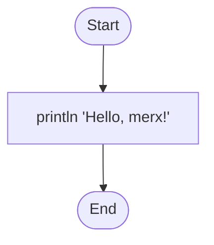

<h1 align="center">Merx</h1>
<p align="center">
<i>Run your flowcharts.</i>
</p>

<p align='center'>
<a href="https://github.com/koki-develop/merx/releases/latest"></a>
<a href="./LICENSE"></a>
<a href="https://github.com/koki-develop/merx/actions/workflows/ci.yml"></a>
<a href="https://codecov.io/gh/koki-develop/merx" ></a>
</p>

<p align="center">
Merx is an interpreter that executes programs written in Mermaid flowchart syntax.
</p>



```console
$ merx run hello.mmd
Hello, merx!
```

## Installation

### Homebrew

```sh
brew install koki-develop/tap/merx
```

### GitHub Releases

Download the binary from [GitHub Releases](https://github.com/koki-develop/merx/releases).

## Documentation

For more details, see the [documentation](https://koki-develop.github.io/merx/).

## License

[MIT](./LICENSE)
