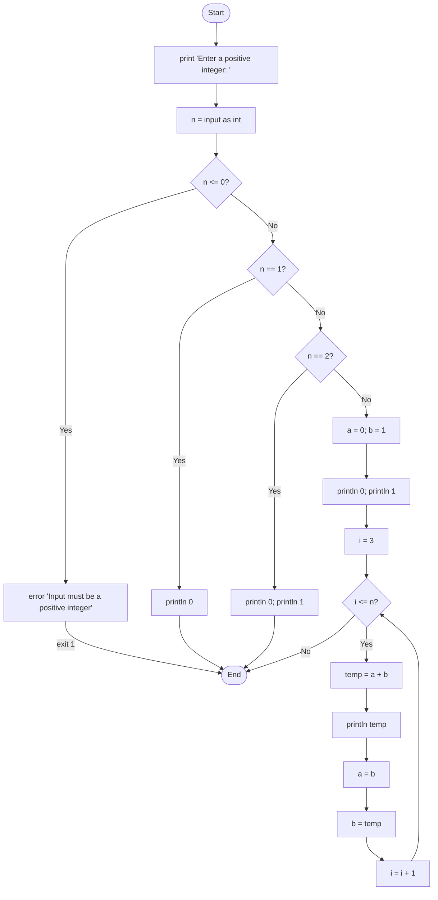
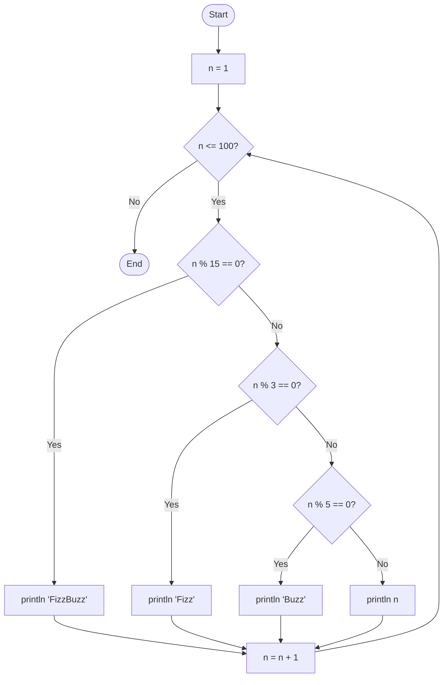

# Examples

## Fibonacci

This example prints the Fibonacci sequence up to the `n`-th term, where `n` is provided by user input.

### Flowchart



### Run

```console
$ merx run fibonacci.mmd
Enter a positive integer: 10
0
1
1
2
3
5
8
13
21
34
```

## FizzBuzz

This example prints the numbers from 1 to 100, replacing multiples of 3 with "Fizz", multiples of 5 with "Buzz", and multiples of both with "FizzBuzz".

### Flowchart



### Run

```console
$ merx run fizzbuzz.mmd
1
2
Fizz
4
Buzz
Fizz
7
8
Fizz
Buzz
11
Fizz
13
14
FizzBuzz
...
```
