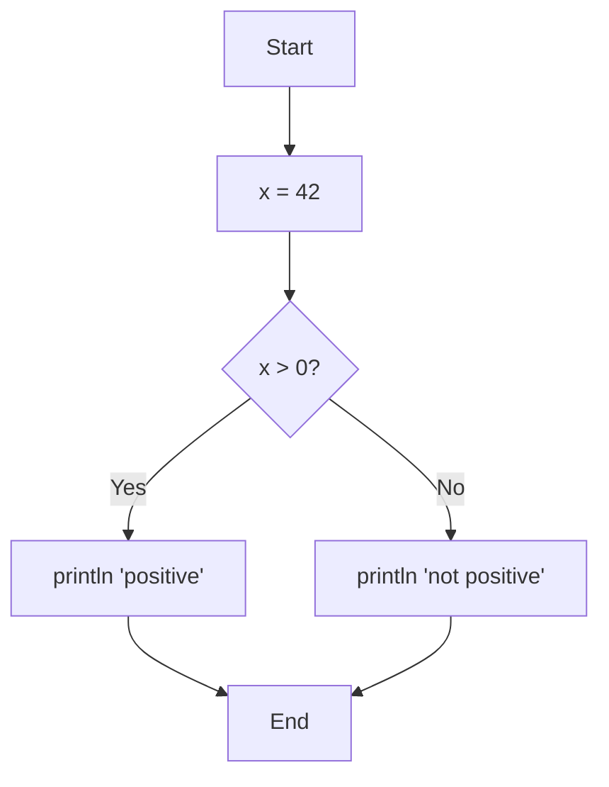
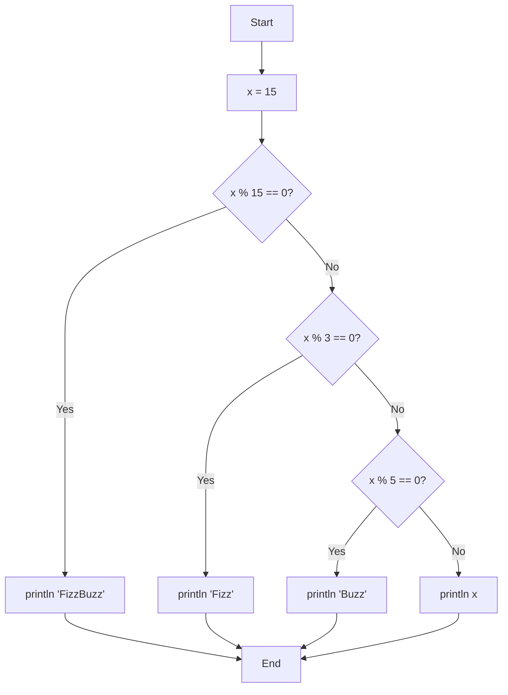
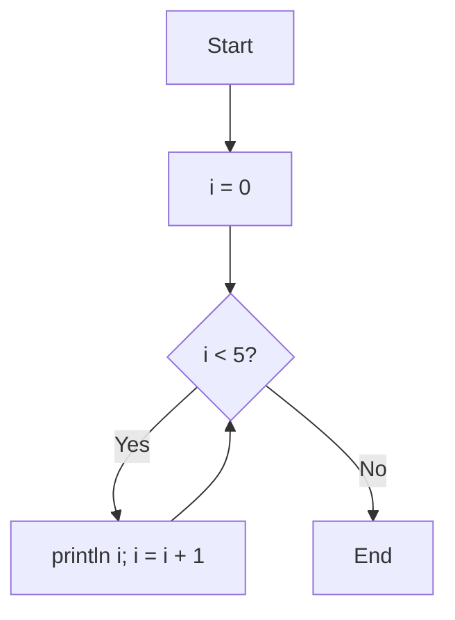
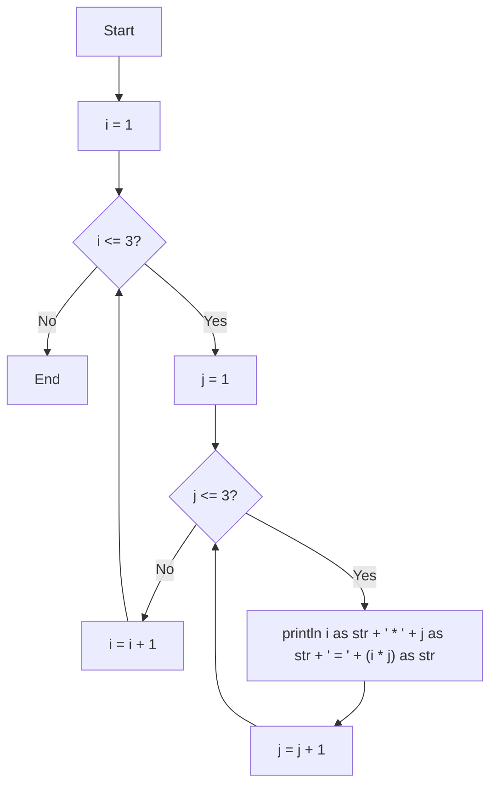

# Control Flow

## Execution Flow

merx programs execute by traversing the flowchart from `Start` to `End`:

1. Begin at the `Start` node
2. Follow the outgoing edge to the next node
3. At each node:
   - **Process node**: Execute all statements, then follow the outgoing edge
   - **Condition node**: Evaluate the condition, then follow the `Yes` or `No` edge
4. Repeat until the `End` node is reached

## Conditional Branching

Use a Condition node `{}` with a trailing `?` to branch based on a condition. The node must have exactly two outgoing edges labeled `Yes` and `No`:

```mmd
flowchart TD
    Start --> A[x = 42]
    A --> B{x > 0?}
    B -->|Yes| C[println 'positive']
    B -->|No| D[println 'not positive']
    C --> End
    D --> End
```



```console
$ merx run branch.mmd
positive
```

The condition expression must evaluate to a `bool` value. If it evaluates to `true`, the `Yes` edge is followed; if `false`, the `No` edge is followed.

### Nested Conditions

You can chain multiple conditions by connecting Condition nodes:

```mmd
flowchart TD
    Start --> A[x = 15]
    A --> B{x % 15 == 0?}
    B -->|Yes| C[println 'FizzBuzz']
    B -->|No| D{x % 3 == 0?}
    D -->|Yes| E[println 'Fizz']
    D -->|No| F{x % 5 == 0?}
    F -->|Yes| G[println 'Buzz']
    F -->|No| H[println x]
    C --> End
    E --> End
    G --> End
    H --> End
```



## Loops

Loops are created by connecting an edge back to a previous node. There is no special loop syntax; you simply point an edge to an earlier node in the flowchart:

```mmd
flowchart TD
    Start --> A[i = 0]
    A --> B{i < 5?}
    B -->|Yes| C[println i; i = i + 1]
    C --> B
    B -->|No| End
```



```console
$ merx run loop.mmd
0
1
2
3
4
```

In this example:
1. `i` is initialized to `0`
2. The Condition node checks if `i < 5`
3. If `Yes`, the value of `i` is printed and incremented
4. The edge from `C` goes back to `B`, creating a loop
5. When `i` reaches `5`, the `No` edge leads to `End`

### Nested Loops

You can nest loops by using multiple Condition nodes:

```mmd
flowchart TD
    Start --> A[i = 1]
    A --> B{i <= 3?}
    B -->|No| End
    B -->|Yes| C[j = 1]
    C --> D{j <= 3?}
    D -->|No| E[i = i + 1]
    E --> B
    D -->|Yes| F[println i as str + ' * ' + j as str + ' = ' + (i * j) as str]
    F --> G[j = j + 1]
    G --> D
```



```console
$ merx run nested.mmd
1 * 1 = 1
1 * 2 = 2
1 * 3 = 3
2 * 1 = 2
2 * 2 = 4
2 * 3 = 6
3 * 1 = 3
3 * 2 = 6
3 * 3 = 9
```
