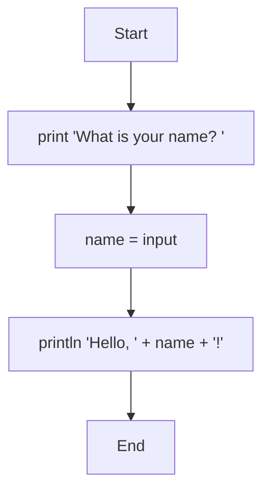
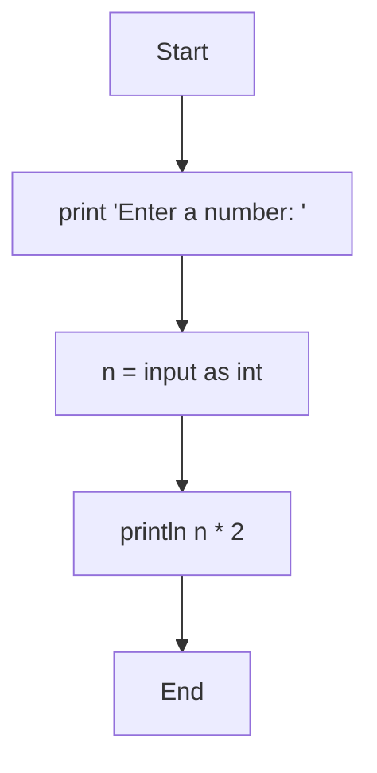
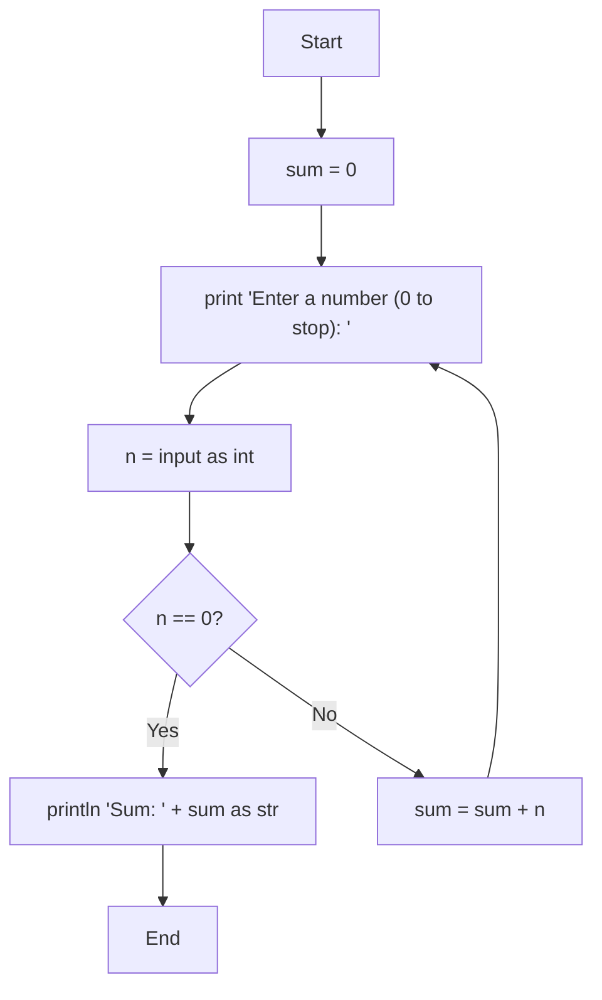

# Input

## The `input` Expression

The `input` expression reads a single line from standard input and returns it as a string:

```mmd
flowchart TD
    Start --> A[print 'What is your name? ']
    A --> B[name = input]
    B --> C[println 'Hello, ' + name + '!']
    C --> End
```



```console
$ merx run greet.mmd
What is your name? merx
Hello, merx!
```

- Trailing newline characters (`\r`, `\n`) are stripped
- If the input reaches EOF, an empty string is returned

## Converting Input Types

Since `input` always returns a string, use the `as` operator to convert it to the desired type:

```mmd
flowchart TD
    Start --> A[print 'Enter a number: ']
    A --> B[n = input as int]
    B --> C[println n * 2]
    C --> End
```



```console
$ merx run double.mmd
Enter a number: 21
42
```

If the input cannot be converted (e.g., `'abc' as int`), a runtime error occurs.

## Practical Example: Sum Calculator

This program reads numbers from the user until they enter `0`, then prints the sum:

```mmd
flowchart TD
    Start --> A[sum = 0]
    A --> B[print 'Enter a number (0 to stop): ']
    B --> C[n = input as int]
    C --> D{n == 0?}
    D -->|Yes| E[println 'Sum: ' + sum as str]
    E --> End
    D -->|No| F[sum = sum + n]
    F --> B
```



```console
$ merx run sum.mmd
Enter a number (0 to stop): 10
Enter a number (0 to stop): 20
Enter a number (0 to stop): 30
Enter a number (0 to stop): 0
Sum: 60
```
