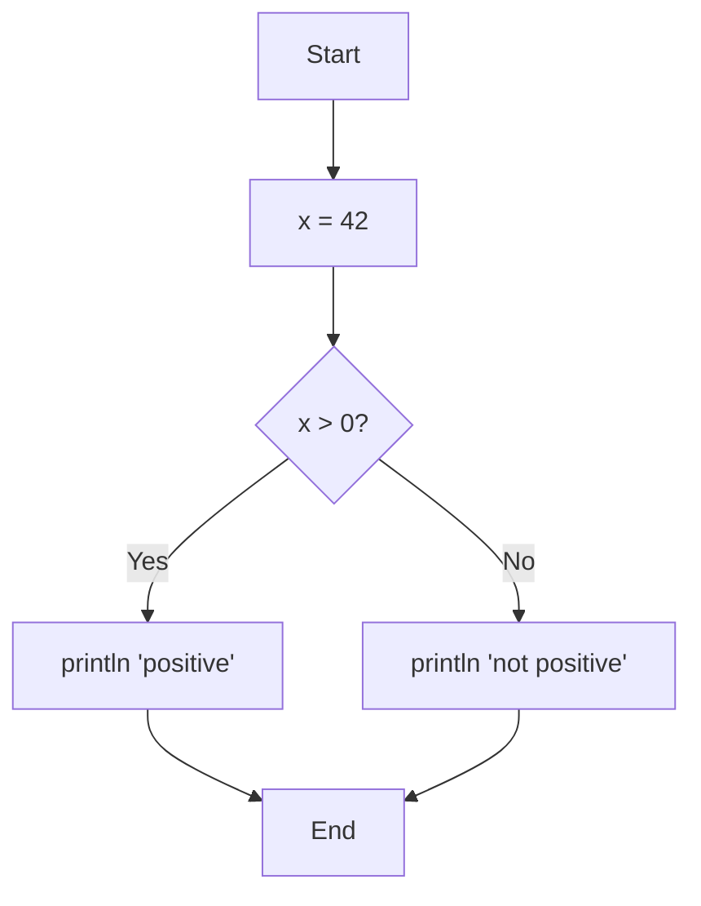
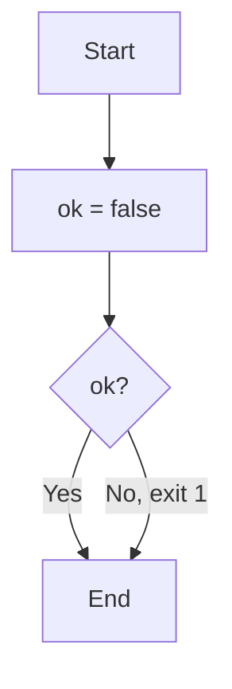

# Nodes and Edges

## Node Types

merx has four types of nodes:

### Start Node

The entry point of the program. Every program must have exactly one.

```
Start
Start([Start])
Start(["Start"])
```

### End Node

The exit point of the program. Every program must have exactly one. No edges can go out from the End node.

```
End
End([End])
End(["End"])
```

### Process Node

Executes one or more statements. Enclosed in square brackets `[]`:

```
A[println 'hello']
A["println 'hello'"]
```

A Process node can have at most one outgoing edge.

### Condition Node

Evaluates a condition and branches based on the result. Enclosed in curly braces `{}` with a trailing `?`:

```
B{x > 0?}
B{"x > 0?"}
```

A Condition node must have exactly two outgoing edges labeled `Yes` and `No`.

## Node IDs

Each node has a unique ID. IDs follow these rules:

- Must start with a letter (`A-Z`, `a-z`) or underscore (`_`)
- Can contain letters, digits (`0-9`), and underscores
- `Start`, `End`, `true`, `false`, `input`, `as`, `int`, `str`, `println`, `print`, `error` are reserved and cannot be used as node IDs or variable names

```
A           %% valid
myNode      %% valid
_count      %% valid
node123     %% valid
```

## Edge Syntax

### Basic Arrows

```
A --> B
A ---> B
```

You can add extra hyphens to make the arrow longer (`--...->`). This affects the diagram layout but not execution.

### Edge Labels

Labels can be added in two ways:

**Pipe syntax:**

```
A -->|label| B
```

**Inline syntax:**

```
A -- label --> B
```

Both syntaxes produce the same result. You cannot use both on the same edge.

### Condition Labels

Condition nodes require `Yes` and `No` labels (case-insensitive) on their outgoing edges:

```mmd
flowchart TD
    Start --> A[x = 42]
    A --> B{x > 0?}
    B -->|Yes| C[println 'positive']
    B -->|No| D[println 'not positive']
    C --> End
    D --> End
```



### Exit Codes

You can specify an exit code on edges that lead to the End node using the `exit N` syntax, where `N` is an integer from 0 to 255:

```mmd
flowchart TD
    Start --> A[ok = false]
    A --> B{ok?}
    B -->|Yes| End
    B -->|No, exit 1| End
```



Exit code variants:

| Label | Description |
|-------|-------------|
| `exit N` | Exit with code N |
| `Yes, exit N` | Yes branch with exit code |
| `No, exit N` | No branch with exit code |

If no exit code is specified, the default is `0`.

::: warning
Exit codes can only be used on edges that point to the End node. Using them on other edges will cause a validation error.
:::
