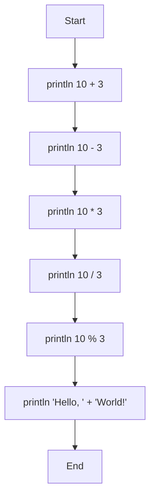
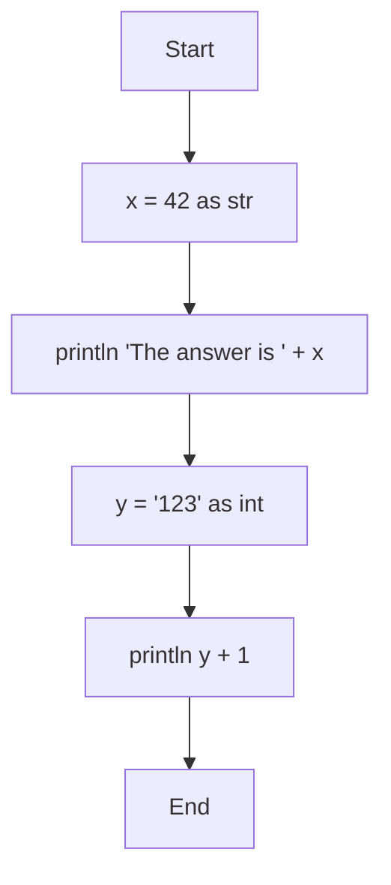

# Operators

## Arithmetic Operators

| Operator | Meaning | Operand Types | Result Type |
|----------|---------|--------------|-------------|
| `+` | Addition | `int`, `int` | `int` |
| `+` | String concatenation | `str`, `str` | `str` |
| `-` | Subtraction | `int`, `int` | `int` |
| `*` | Multiplication | `int`, `int` | `int` |
| `/` | Division (truncates toward zero) | `int`, `int` | `int` |
| `%` | Remainder | `int`, `int` | `int` |

The `+` operator works as addition for integers and concatenation for strings. The behavior is determined by the left operand's type. Mixing types (e.g., `int + str`) or using `bool` operands with `+` causes a runtime error.

```mmd
flowchart TD
    Start --> A[println 10 + 3]
    A --> B[println 10 - 3]
    B --> C[println 10 * 3]
    C --> D[println 10 / 3]
    D --> E[println 10 % 3]
    E --> F[println 'Hello, ' + 'World!']
    F --> End
```



```console
$ merx run arith.mmd
13
7
30
3
1
Hello, World!
```

::: info
- Division by zero causes a runtime error.
- Addition, subtraction, and multiplication wrap around on overflow.
- The `%` operator follows Rust semantics: `-10 % 3 == -1`.
:::

## Comparison Operators

| Operator | Meaning | Operand Types | Result Type |
|----------|---------|--------------|-------------|
| `<` | Less than | `int`, `int` | `bool` |
| `<=` | Less than or equal | `int`, `int` | `bool` |
| `>` | Greater than | `int`, `int` | `bool` |
| `>=` | Greater than or equal | `int`, `int` | `bool` |

## Equality Operators

| Operator | Meaning | Operand Types | Result Type |
|----------|---------|--------------|-------------|
| `==` | Equal | any | `bool` |
| `!=` | Not equal | any | `bool` |

Comparing values of different types always results in `false` for `==` and `true` for `!=`.

## Logical Operators

| Operator | Meaning | Operand Types | Result Type |
|----------|---------|--------------|-------------|
| `&&` | Logical AND | `bool`, `bool` | `bool` |
| `\|\|` | Logical OR | `bool`, `bool` | `bool` |

::: warning
Both sides are always evaluated. There is no short-circuit evaluation.
:::

## Unary Operators

| Operator | Meaning | Operand Type | Result Type |
|----------|---------|-------------|-------------|
| `-` | Arithmetic negation | `int` | `int` |
| `!` | Logical NOT | `bool` | `bool` |

Unary operators can be chained: `--x`, `!!b`.

## Operator Precedence

Operators are listed from highest to lowest precedence. Operators at the same level are left-associative.

| Precedence | Operators | Description |
|-----------|-----------|-------------|
| 1 (highest) | `-` (unary), `!` | Unary operators |
| 2 | `as` | Type cast |
| 3 | `*`, `/`, `%` | Multiplication, division, remainder |
| 4 | `+`, `-` | Addition, subtraction |
| 5 | `<`, `<=`, `>`, `>=` | Comparison |
| 6 | `==`, `!=` | Equality |
| 7 | `&&` | Logical AND |
| 8 (lowest) | `\|\|` | Logical OR |

Use parentheses `()` to override precedence.

## Type Casting

The `as` operator converts a value to a different type:

```
expression as type
```

| From | To | Behavior |
|------|----|----------|
| `int` | `int` | No-op |
| `str` | `int` | Parses as decimal. Runtime error on failure |
| `bool` | `int` | **Error** (not supported) |
| `int` | `str` | Converts to decimal string |
| `str` | `str` | No-op |
| `bool` | `str` | `"true"` or `"false"` |

There is no `bool` cast target in the language.

```mmd
flowchart TD
    Start --> A[x = 42 as str]
    A --> B[println 'The answer is ' + x]
    B --> C[y = '123' as int]
    C --> D[println y + 1]
    D --> End
```



```console
$ merx run cast.mmd
The answer is 42
124
```
