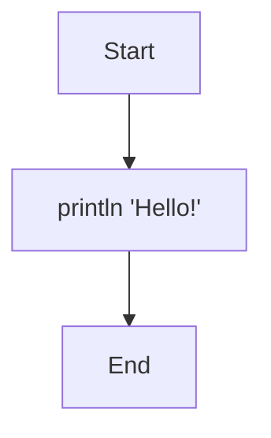
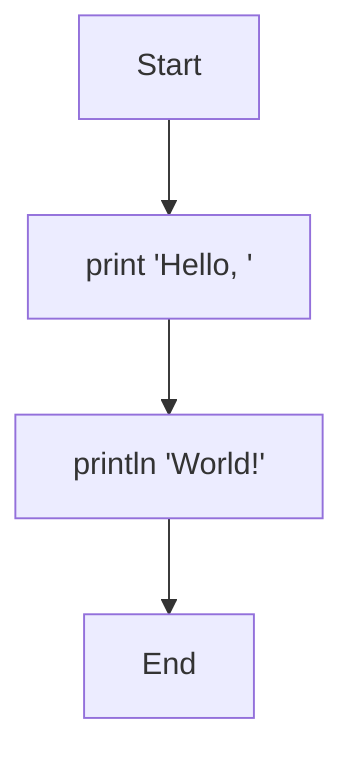
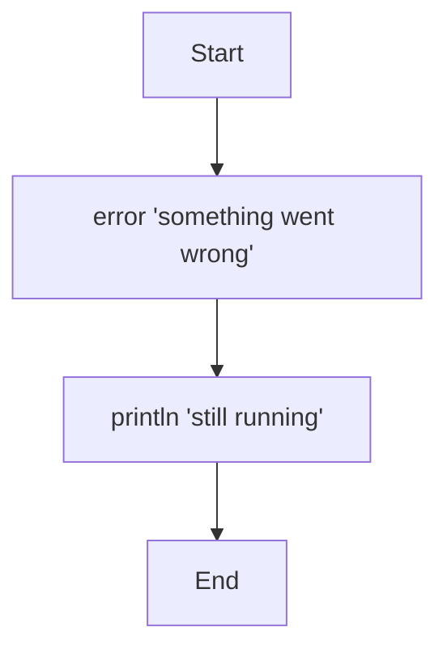
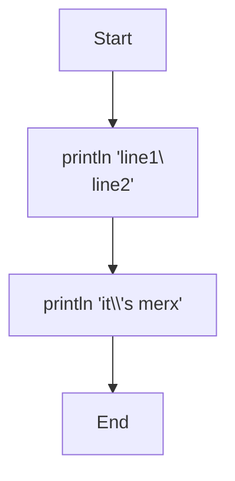

# Output

merx provides three output statements: `println`, `print`, and `error`.

## println

Prints the value of an expression to standard output, followed by a newline:

```mmd
flowchart TD
    Start --> A[println 'Hello!']
    A --> End
```



```console
$ merx run hello.mmd
Hello!
```

## print

Prints the value of an expression to standard output **without** a trailing newline:

```mmd
flowchart TD
    Start --> A[print 'Hello, ']
    A --> B[println 'World!']
    B --> End
```



```console
$ merx run hello.mmd
Hello, World!
```

## error

Prints the value of an expression to **standard error**, followed by a newline. Execution continues normally after the `error` statement:

```mmd
flowchart TD
    Start --> A[error 'something went wrong']
    A --> B[println 'still running']
    B --> End
```



## String Literals

Strings are enclosed in single quotes:

```
'Hello, World!'
'merx'
''
```

### Escape Sequences

The following escape sequences are available inside string literals:

| Sequence | Meaning |
|----------|---------|
| `\\'` | Single quote |
| `\\\\` | Backslash |
| `\\n` | Newline (LF) |
| `\\t` | Tab |
| `\\r` | Carriage return (CR) |
| `\\0` | Null character |
| `\\xHH` | Hex byte value |

A bare `\` or `'` inside a string is not allowed; you must use the escape sequence.

Example:

```mmd
flowchart TD
    Start --> A[println 'line1\\nline2']
    A --> B[println 'it\\'s merx']
    B --> End
```



```console
$ merx run escape.mmd
line1
line2
it's merx
```

## Output Format

Each type has a specific output format:

| Type | Format | Example |
|------|--------|---------|
| `int` | Decimal number | `42`, `-17` |
| `str` | The string itself (no quotes) | `hello` |
| `bool` | `true` or `false` | `true` |
