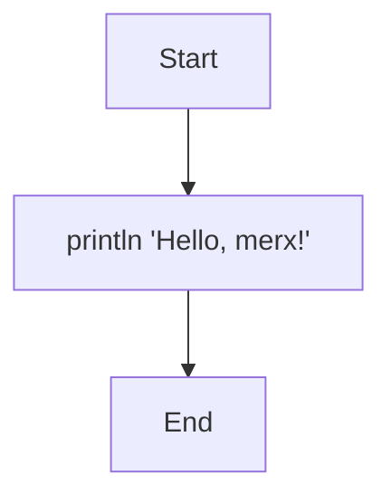
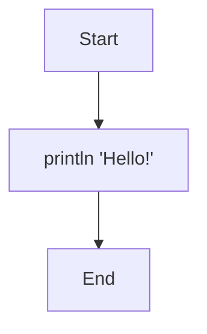
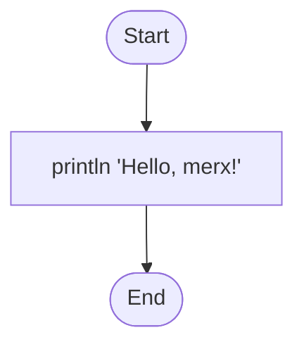

# Program Structure

Every merx program is a Mermaid flowchart. It starts with a `flowchart` declaration, followed by node and edge definitions.

## Flowchart Declaration

A program begins with the `flowchart` keyword and a direction:

```mmd
flowchart TD
    Start --> A[println 'Hello, merx!']
    A --> End
```



The direction specifies the layout of the flowchart diagram. It does not affect execution.

| Direction | Meaning |
|-----------|---------|
| `TD` | Top to Down |
| `TB` | Top to Bottom |
| `LR` | Left to Right |
| `RL` | Right to Left |
| `BT` | Bottom to Top |

## Start and End Nodes

Every program must have exactly one `Start` node and one `End` node.

- **Start** is the entry point. Execution begins here.
- **End** is the exit point. When reached, the program terminates.

Both can have optional labels:

```
Start
Start([Start])
Start(["Start"])

End
End([End])
End(["End"])
```

## Edges

Edges are arrows that connect nodes and define the control flow. The basic syntax is `-->`:

```mmd
flowchart TD
    Start --> A[println 'Hello!']
    A --> End
```



Execution follows the edges from `Start` to `End`, visiting each node along the way.

## Process Nodes

Process nodes execute statements. They are written with square brackets `[]`:

```mmd
flowchart TD
    Start --> A[println 'Hello, merx!']
    A --> End
```


In this example, node `A` executes `println 'Hello, merx!'`, which prints the string to the console.

## Comments

Use `%%` to add comments. Everything after `%%` until the end of the line is ignored:

```mmd
flowchart TD
    %% This is a comment
    Start --> A[println 'Hello!'] %% Inline comment
    A --> End
```

## Putting It All Together

Here is a minimal merx program that prints a greeting:

```mmd
flowchart TD
    Start([Start]) --> A[println 'Hello, merx!']
    A --> End([End])
```



```console
$ merx run hello.mmd
Hello, merx!
```
