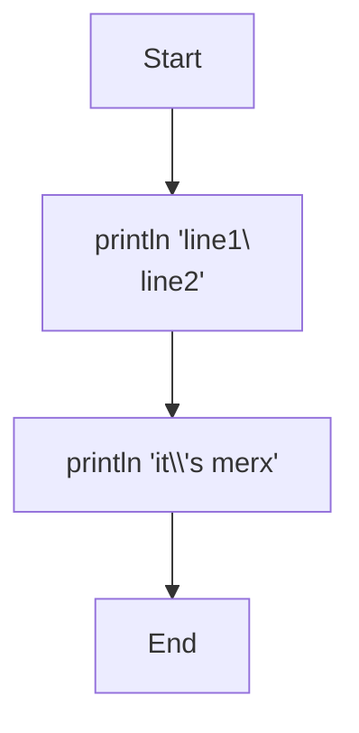
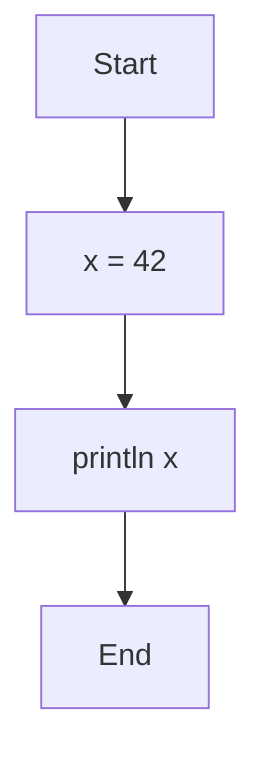
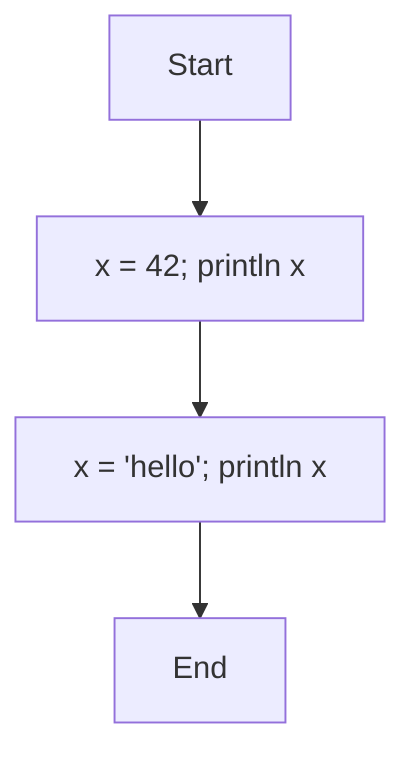
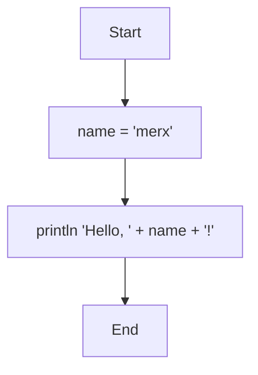
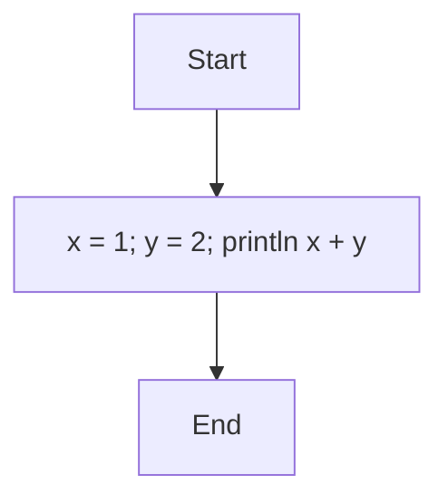
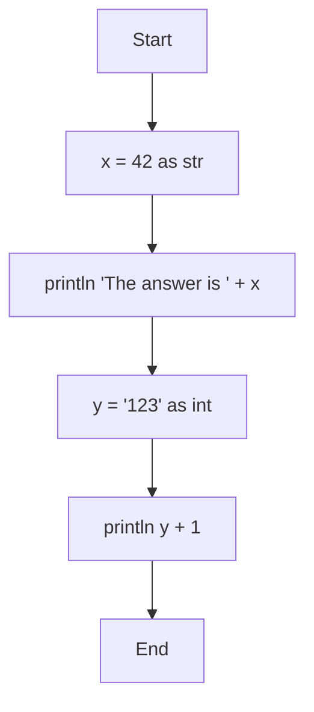

# Variables and Types

## Types

merx has three types:

| Type | Description | Examples |
|------|-------------|----------|
| `int` | 64-bit signed integer | `0`, `42`, `-17` |
| `str` | UTF-8 string | `'hello'`, `''` |
| `bool` | Boolean | `true`, `false` |

There are no implicit type conversions. To convert between types, use the `as` operator (see [Type Casting](#type-casting)).

### String Literals

Strings are enclosed in single quotes:

```
'Hello, World!'
'merx'
''
```

#### Escape Sequences

The following escape sequences are available inside string literals:

| Sequence | Meaning |
|----------|---------|
| `\\'` | Single quote |
| `\\\\` | Backslash |
| `\\n` | Newline (LF) |
| `\\t` | Tab |
| `\\r` | Carriage return (CR) |
| `\\0` | Null character |
| `\\xHH` | Hex byte value |

A bare `\` or `'` inside a string is not allowed; you must use the escape sequence.

Example:

```mmd
flowchart TD
    Start --> A[println 'line1\\nline2']
    A --> B[println 'it\\'s merx']
    B --> End
```



```console
$ merx run escape.mmd
line1
line2
it's merx
```

## Variables

### Assignment

Use `=` to assign a value to a variable:

```mmd
flowchart TD
    Start --> A[x = 42]
    A --> B[println x]
    B --> End
```



```console
$ merx run assign.mmd
42
```

### Dynamic Typing

Variables can hold values of any type, and the type can change on reassignment:

```mmd
flowchart TD
    Start --> A[x = 42; println x]
    A --> B[x = 'hello'; println x]
    B --> End
```



```console
$ merx run dynamic.mmd
42
hello
```

### Global Scope

All variables are global. A variable assigned in one node is accessible from any subsequent node:

```mmd
flowchart TD
    Start --> A[name = 'merx']
    A --> B[println 'Hello, ' + name + '!']
    B --> End
```



```console
$ merx run scope.mmd
Hello, merx!
```

Referencing an undefined variable causes a runtime error.

## Multiple Statements

You can write multiple statements in a single Process node by separating them with semicolons `;`:

```mmd
flowchart TD
    Start --> A[x = 1; y = 2; println x + y]
    A --> End
```



```console
$ merx run multi.mmd
3
```

Statements are executed in order from left to right.

## Type Casting

The `as` operator converts a value to a different type:

```
expression as type
```

| From | To | Behavior |
|------|----|----------|
| `int` | `int` | No-op |
| `str` | `int` | Parses as decimal. Runtime error on failure |
| `bool` | `int` | **Error** (not supported) |
| `int` | `str` | Converts to decimal string |
| `str` | `str` | No-op |
| `bool` | `str` | `'true'` or `'false'` |

There is no `bool` cast target in the language.

```mmd
flowchart TD
    Start --> A[x = 42 as str]
    A --> B[println 'The answer is ' + x]
    B --> C[y = '123' as int]
    C --> D[println y + 1]
    D --> End
```



```console
$ merx run cast.mmd
The answer is 42
124
```
