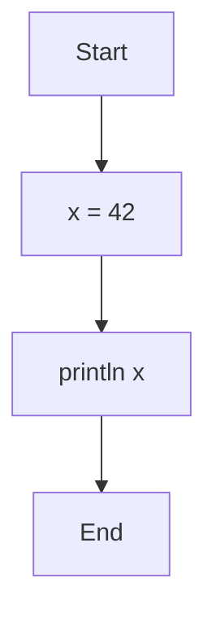
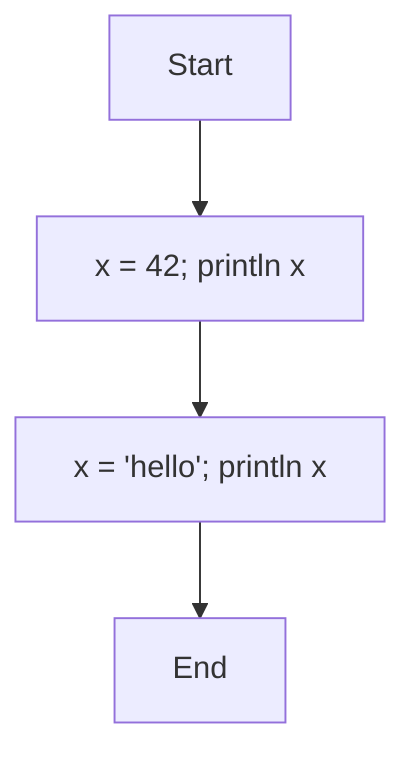
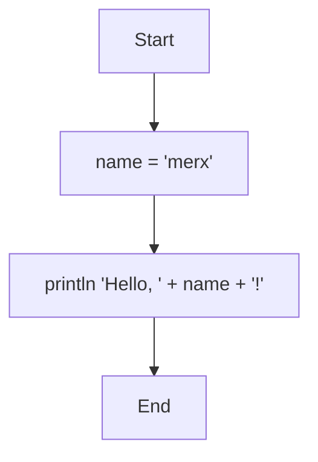
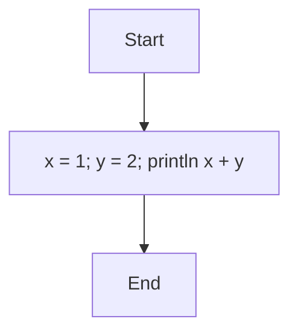

# Variables and Types

## Types

merx has three types:

| Type | Description | Examples |
|------|-------------|----------|
| `int` | 64-bit signed integer | `0`, `42`, `-17` |
| `str` | UTF-8 string | `'hello'`, `''` |
| `bool` | Boolean | `true`, `false` |

There are no implicit type conversions. To convert between types, use the `as` operator (see [Operators](./operators.md)).

## Variables

### Assignment

Use `=` to assign a value to a variable:

```mmd
flowchart TD
    Start --> A[x = 42]
    A --> B[println x]
    B --> End
```



```console
$ merx run assign.mmd
42
```

### Dynamic Typing

Variables can hold values of any type, and the type can change on reassignment:

```mmd
flowchart TD
    Start --> A[x = 42; println x]
    A --> B[x = 'hello'; println x]
    B --> End
```



```console
$ merx run dynamic.mmd
42
hello
```

### Global Scope

All variables are global. A variable assigned in one node is accessible from any subsequent node:

```mmd
flowchart TD
    Start --> A[name = 'merx']
    A --> B[println 'Hello, ' + name + '!']
    B --> End
```



```console
$ merx run scope.mmd
Hello, merx!
```

Referencing an undefined variable causes a runtime error.

## Multiple Statements

You can write multiple statements in a single Process node by separating them with semicolons `;`:

```mmd
flowchart TD
    Start --> A[x = 1; y = 2; println x + y]
    A --> End
```



```console
$ merx run multi.mmd
3
```

Statements are executed in order from left to right.
